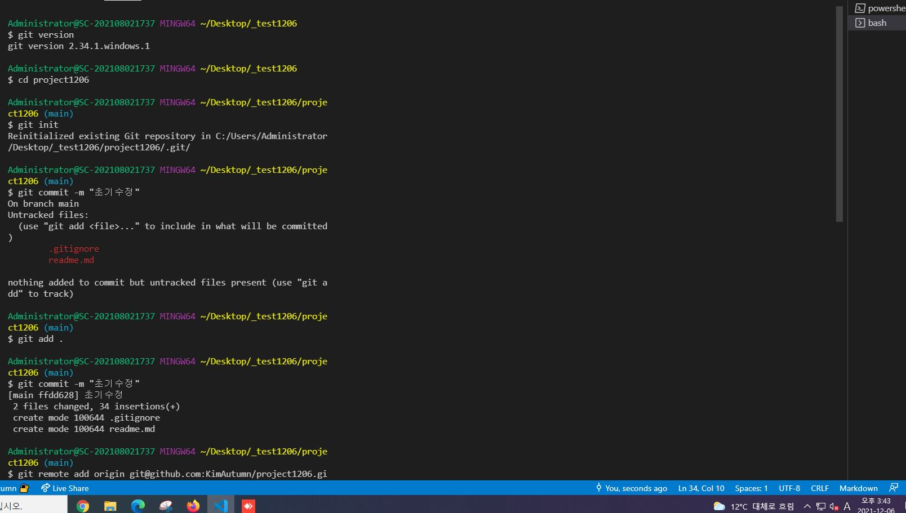

# 08-응용SW기초기술활용-김아름

2021.12.06 test
```
**프로젝트 기간** : 2021.12.06 ~    
```
  
 
---

**1. git version**


**2. github repository**  
레파지토리 주소: <https://github.com/KimAutumn/project1206>

**3. git 사용해본 소감**   
> 🙋‍♀️형상관리 도구 git을 사용하기 전과, 사용하고 나서 느낀점을 적어주세요.   

    👉답변: 하기 전에는 무슨 소리인지 모르겠고 뭐가 뭔지 몰랐지만 막상 배워보니 git이 무엇인지 알게 되고 편리한 기능이란 것을 알았습니다.

> 🙋‍♀️현재까지 프로젝트를 진행하면서 어려우셨던 점을 적어주세요. 

    👉답변: 처음 배울 때는 전부 어려웠지만 지금은 괜찮아진 것 같아요.

> 🙋‍♀️현재까지 프로젝트를 진행하면서 뿌듯했던 점이 있다면 적어주세요. 

    👉답변: 아무래도 개인 포트폴리오를 만든 것이 가장 뿌듯한 것 같습니다.

> 🙋‍♀️이번주까지 작업목표를 적어주세요.

    👉답변: 개인 포트폴리오 사이트를 완성하는 것이 목표입니다.